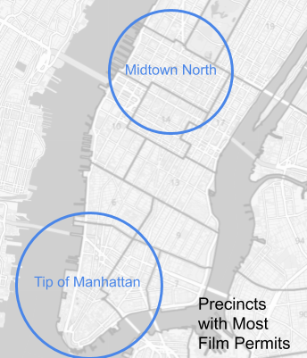

Comparing NYC Film Locations, Real Estate Prices, and Crime Rates
-
Data source: 
  - Film Permits
    - Aggregated by zipcode and police precinct
  - Citywide Crime Statistics
    - All violations, 7 Major Felonies, and Misdemeanors
  - Property Valuation and Assessment Data
    - Aggregated by zipcode
  
Goal
-
To answer the question: How does the film industry impact the communities they film in?

Who would this benefit?
1) Film studios: Which areas of Manhattan are commonly portrayed in TV/Film? What are the risks of filming in these locations?

2) Property Owners: Will your your property value increase if more media is produced in your area?

3) Communities where films are made: Are crimes more common in areas that are filmed in more frequently?

This exploration could help to incentivize media companies to film in Manhattan while generating economic value for property owners while reducing instances of crime.

Statistical Testing
-
Compare arrests in the two most popular film locations using a two-sample t-test to see if the average number of felonies in each film location is significantly different.

 

- H(a): You can use past crime statistics to determine which area will have more crime.

- H(0): Past years' crime statistics cannot be used to predict future crime rates in one area over another

  - Alpha = 0.05
  - p-value = 0.0001 for major felonies, even lower for all other major crimes

Result: We can reject the null hypothesis for each type of crime. 

Conclusions
-

Further Exploration
-
